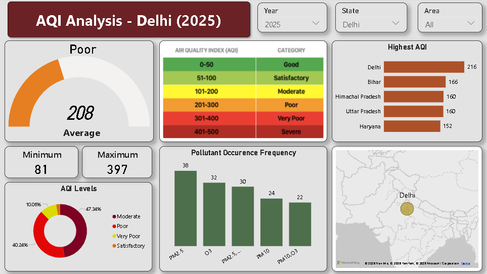

# AQI Analysis Dashboard

## 📌 Project Overview

This project presents an **Air Quality Index (AQI) Analysis Dashboard** built using **Microsoft Power BI**.
The dashboard provides interactive insights into Delhi’s air quality trends for the year **2025**, helping users understand pollution levels, pollutant distribution, and regional comparisons.

The objective of this project is to transform raw AQI data into meaningful visual insights for better environmental monitoring and decision-making.

---

## 🖼️ Dashboard Preview

---

## 📊 Key Dashboard Features

### 1️⃣ AQI Summary Metrics

* **Average AQI:** 208 (Poor Category)
* **Minimum AQI:** 81
* **Maximum AQI:** 397
* AQI Category Indicator (Good → Severe)

---

### 2️⃣ AQI Category Distribution

* Moderate – 47.34%
* Poor – 40.24%
* Very Poor – 10.06%
* Satisfactory – Remaining %

Helps understand overall air quality classification trends.

---

### 3️⃣ Highest AQI by State

Comparison of Delhi with nearby states:

* Delhi – 216
* Bihar – 166
* Himachal Pradesh – 160
* Uttar Pradesh – 160
* Haryana – 152

Provides regional pollution comparison insights.

---

### 4️⃣ Pollutant Occurrence Frequency

Top pollutants contributing to AQI:

* PM2.5 – 38
* O₃ – 32
* PM10 – 30
* NO₂ – 24
* SO₂ – 22

Identifies major pollution drivers affecting air quality.

---

### 5️⃣ Interactive Filters

* Year Selection
* State Selection
* Area Selection

Enables dynamic and real-time data exploration.

---

## 🛠️ Tools & Technologies Used

* **Microsoft Power BI**
* Power Query (Data Cleaning & Transformation)
* DAX (Data Analysis Expressions)
* Data Modeling
* Interactive Visualizations

---

## 📂 Dataset Description

The dataset contains:

* AQI values
* Pollutant levels (PM2.5, PM10, NO₂, SO₂, O₃)
* State-wise AQI records
* Area-wise data
* Year-wise filtering support

---

## 📈 Business / Analytical Insights

* Delhi’s AQI falls in the **“Poor” category on average**, indicating unhealthy air quality.
* PM2.5 is the most dominant pollutant.
* AQI occasionally reaches **Very Poor levels (397 max)**.
* Regional comparison highlights Delhi as the highest AQI region among selected states.

---

## 🎯 Project Objectives

* To analyze and visualize AQI trends.
* To identify major pollutant contributors.
* To compare regional air quality levels.
* To build an interactive and user-friendly Power BI dashboard.

---

## 🚀 How to Use

1. Download the `.pbix` file.
2. Open in **Microsoft Power BI Desktop**.
3. Use filters (Year, State, Area) to explore insights.
4. Interact with visuals for detailed analysis.

---

## 👨‍💻 Author

**Aryan Bataviya**
Data Analyst | Power BI | SQL | Python

📌 Passionate about transforming data into actionable insights.

